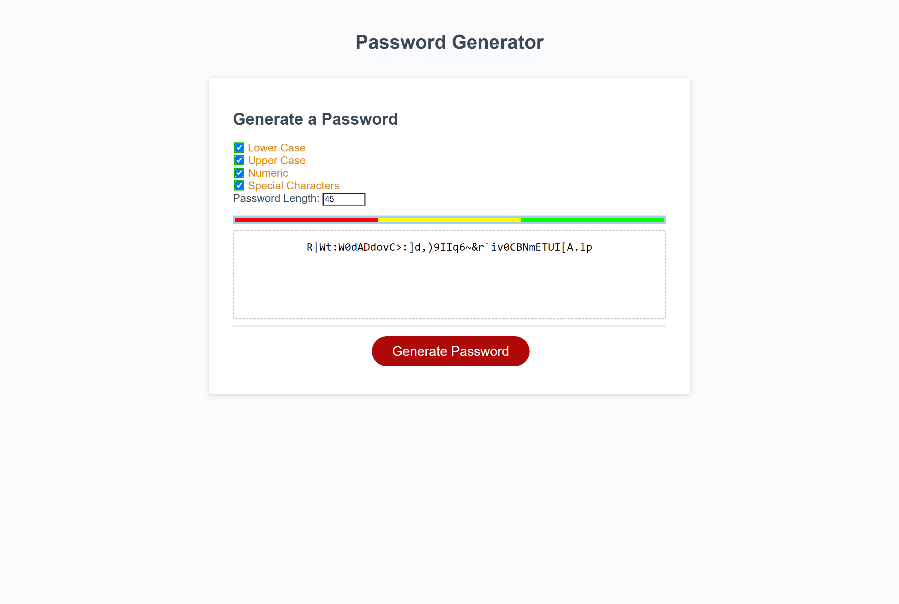

## Password Generator

---

---

## Acceptance Criteria for Password Generator

```
GIVEN I need a new, secure password
WHEN I click the button to generate a password
THEN I am presented with a series of prompts for password criteria
WHEN prompted for password criteria
THEN I select which criteria to include in the password
WHEN prompted for the length of the password
THEN I choose a length of at least 8 characters and no more than 128 characters
WHEN prompted for character types to include in the password
THEN I choose lowercase, uppercase, numeric, and/or special characters
WHEN I answer each prompt
THEN my input should be validated and at least one character type should be selected
WHEN all prompts are answered
THEN a password is generated that matches the selected criteria
WHEN the password is generated
THEN the password is either displayed in an alert or written to the page
```

## Have confirmed with instructor to use checkboxes instead of confirm prompts

#### JS

     [x] generatePassword() function to generate password
     [x] Declared each character set as string
     [x] Setting our password selected characters and our output password to empty string
     [x] Checking to see if at least one of the options is selected
     [x] If none is selected than alert user to select one of the options
     [x] Checking if our password length meets requirement 8-128 characters
     [x] Checking to see which options are selectet and adding character sets to our passwordCharacters
     [x] Running for loop and randomly choosing from our passwordCharacters
     [x] -Bonus- Running our password strenght indicator function
     [x] Returning our password
     [x] If the lenght is not in the range alert user
     [x] writePassword() displaying password
     [x] -Bonus- passwordStrenght() checks and displays password strenght
     [x] -Bonus- Added event listener on password text area, when clicked password is copied to clipboard

---


